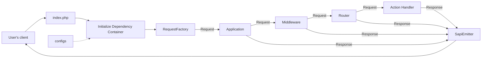

# 运行应用程序

安装 Yii 后，你有了一个可以工作的 Yii 应用程序。本节介绍应用程序的内置功能、代码的组织方式以及应用程序如何处理请求的一般方式。

请注意，与框架本身不同，安装项目模板后，它就完全属于你了。你可以自由添加或删除代码，并根据需要整体更改它。

## 功能 <span id="functionality"></span>

安装的应用程序只包含一个页面，可在 `http://localhost/` 访问。它共享一个通用的布局，你可以在以后的页面上重复使用。

<!--
你还应该在浏览器窗口底部看到一个工具栏。这是 Yii 提供的有用[调试器工具](https://github.com/yiisoft/yii-debug)，用于记录和显示大量调试信息，例如日志消息、响应状态、运行的数据库查询等。
-->

除了 Web 应用程序外，你还可以通过 `APP_ENV=dev ./yii` 或在 Docker 的情况下通过 `make yii` 访问控制台脚本。使用此脚本运行应用程序的后台和维护任务，[控制台应用程序部分](../tutorial/console-applications.md)对此进行了描述。


## 应用程序结构 <span id="application-structure"></span>

应用程序中最重要的目录和文件是（假设应用程序的根目录是 `app`）：

```
assets/                 资源包源文件。
config/                 配置文件。
    common/             通用配置和 DI 定义。
    console/            控制台专用配置。
    environments/       环境专用配置 (dev/test/prod)。
    web/                Web 专用配置。
docker/                 Docker 专用文件。
public/                 可从 Internet 公开访问的文件。
    assets/             已发布/编译的资源。
    index.php           入口脚本。
runtime/                运行时生成的文件。
src/                    应用程序源代码。
    Console/            控制台命令。
    Shared/             Web 和控制台应用程序之间共享的代码。
    Web/                Web 专用代码（操作、处理程序、布局）。
        Shared/         共享的 Web 组件。
            Layout/     布局组件和模板。
    Environment.php     环境配置类。
tests/                  应用程序的一组 Codeception 测试。
    Console/            控制台命令测试。
    Functional/         功能测试。
    Unit/               单元测试。
    Web/                Web 操作测试。
vendor/                 已安装的 Composer 包。
Makefile                make 命令的配置。
yii                     控制台应用程序入口点。
```

通常，应用程序中的文件分为两组：`app/public` 下的文件和其他目录下的文件。你可以通过 HTTP（即在浏览器中）直接访问前者，而不应暴露后者。

每个应用程序都有一个入口脚本 `public/index.php`，它是应用程序中唯一可通过 Web 访问的 PHP 脚本。入口脚本使用[应用程序运行器](https://github.com/yiisoft/yii-runner)在一个 PSR-7 包的帮助下创建传入请求的实例，并将其传递给[应用程序](../structure/application.md)实例。应用程序依次执行一组中间件来处理请求。然后，它将结果传递给发射器，发射器将响应发送到浏览器。

根据你使用的中间件，应用程序的行为可能会有所不同。默认情况下，路由器使用请求的 URL 和配置来选择处理程序并执行它以生成响应。

你可以从 [yiisoft/app 包文档](https://github.com/yiisoft/app/blob/master/README.md) 中了解更多关于应用程序模板的信息。

## 请求生命周期 <span id="request-lifecycle"></span>

下图显示了应用程序如何处理请求。



1. 用户向[入口脚本](../structure/entry-script.md) `public/index.php` 发出请求。
2. 入口脚本借助应用程序运行器加载容器[配置](../concept/configuration.md)并创建[应用程序](../structure/application.md)实例和处理请求所需的服务。
3. 请求工厂根据来自用户的原始请求创建请求对象。
4. 应用程序将请求对象传递给配置的中间件数组。其中之一通常是路由器。
5. 路由器根据请求和配置找出要执行的处理程序。
6. 处理程序可能会加载一些数据，可能来自数据库。
7. 处理程序使用数据形成响应。要么直接，要么借助视图包。
8. 发射器接收响应并负责将响应发送到用户的浏览器。
